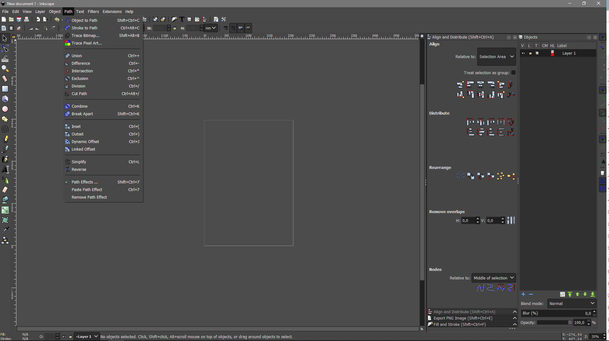

# Dark Theme for Inkscape (Windows)

## How to install on Windows

1. GO TO *C:\Program Files\Inkscape\share\themes\MS-Windows*
2. RENAME your *gtk-2.0 folder* to *gtk-2.0-original*
3. COPY the provided *gtk-2.0 folder*

4. GO TO *C:\Program Files\Inkscape\share\templates*
5. RENAME your *default.svg* to *default.svg-original*
6. COPY the provided *default.svg*
